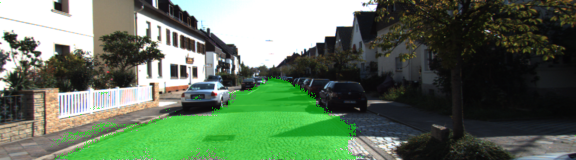
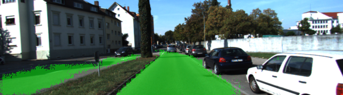

# Semantic Segmentation
### Introduction
Fully Connected Network (FCN) based on [VGG16](https://people.eecs.berkeley.edu/~jonlong/long_shelhamer_fcn.pdf) architecture is implemented to detect pixel wise classification of road in a image. Network is trained on the Kitti road dataset mentioned below.

### Training

|Hyperparameters |  value|
| ---- | ---|
| Learning rate | 0.0009 |
| epochs | 50 |
| batch size | 5 |

Learning curve for the recent training.


### Testing

Below are the four sample output images for the above architecture. More images are in the latest_run directory.






### Setup
##### GPU
`main.py` will check to make sure you are using GPU - if you don't have a GPU on your system, you can use AWS or another cloud computing platform.
##### Frameworks and Packages
Make sure you have the following is installed:
 - [Python 3](https://www.python.org/)
 - [TensorFlow](https://www.tensorflow.org/)
 - [NumPy](http://www.numpy.org/)
 - [SciPy](https://www.scipy.org/)
##### Dataset
Download the [Kitti Road dataset](http://www.cvlibs.net/datasets/kitti/eval_road.php) from [here](http://www.cvlibs.net/download.php?file=data_road.zip).  Extract the dataset in the `data` folder.  This will create the folder `data_road` with all the training a test images.

### Start

##### Run
Run the following command to run the project:
```
python main.py
```
**Note** If running this in Jupyter Notebook system messages, such as those regarding test status, may appear in the terminal rather than the notebook.
